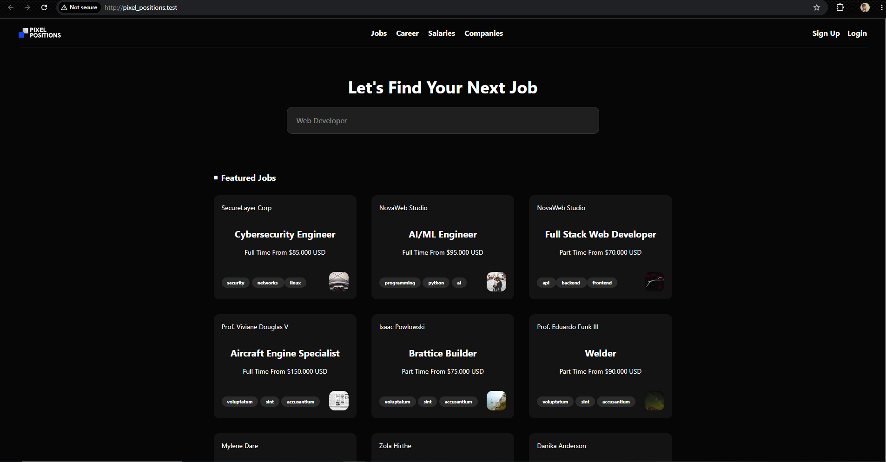
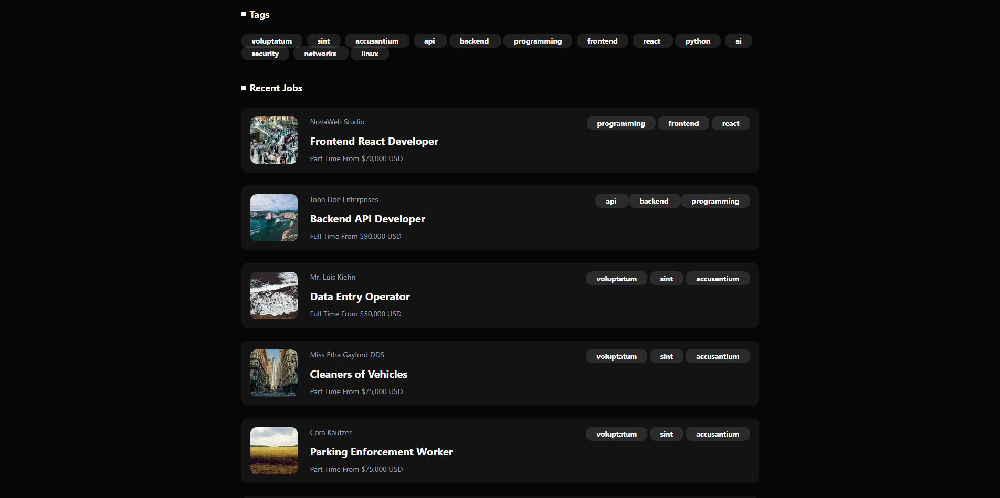
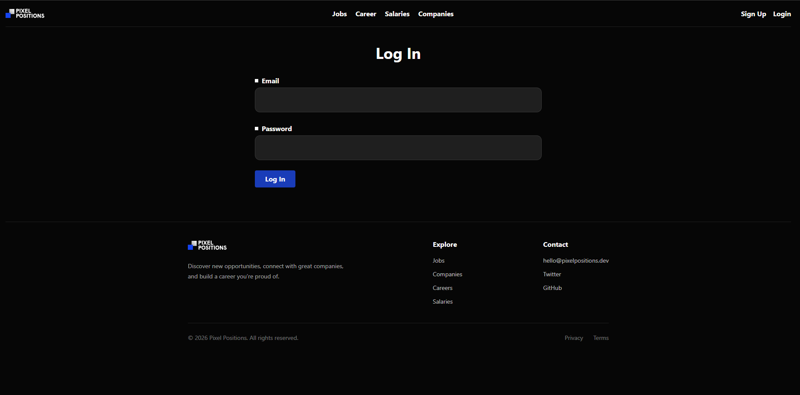
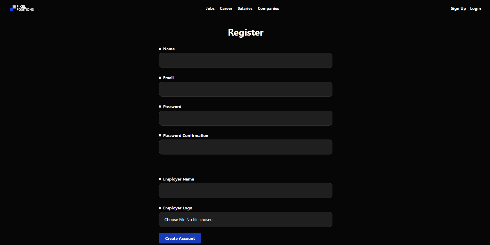

# Pixel Positions

A modern job listing platform built with Laravel that connects employers with job seekers. Employers can create accounts and publish job opportunities, while users can browse featured and recent jobs through a clean and responsive interface.

## 📖 Table of Contents

- [About](#about)
- [Features](#features)
- [Tech Stack](#tech-stack)
- [How It Works](#how-it-works)
- [Project Structure](#project-structure)
- [Installation](#installation)
- [Environment Variables](#environment-variables)
- [Screenshots](#screenshots)
- [Future Improvements](#future-improvements)
- [What I Learned](#what-i-learned)
- [License](#license)

##  About

Pixel Positions is a Laravel-based job listing platform designed to simplify the job search process. Employers can register, manage their company profile, and publish job listings, while visitors can search and browse available positions through an intuitive interface.

The project demonstrates Laravel fundamentals including MVC architecture, authentication, Eloquent ORM, file uploads, database relationships, and responsive UI development with Tailwind CSS.


##  Features

- User Authentication
- Employer Registration
- Company Logo Upload
- Job Listings
- Featured Jobs
- Recent Jobs
- Search Jobs
- Job Tags
- Responsive Design
- Dark Theme UI

  
## Tech Stack


| Technology | Purpose |
|------------|---------|
| Laravel | Backend Framework |
| PHP | Server-side Language |
| Blade | Templating Engine |
| Tailwind CSS | Styling |
| MySQL | Database |
| Eloquent ORM | Database Management |
| Vite | Asset Bundling |

##  How It Works

1. Employers register for an account.
2. Company information and logo are provided during registration.
3. Employers log in to access the platform.
4. Job listings are created and published.
5. Visitors can browse featured jobs, recent jobs, and search for opportunities.

##  Project Structure

```text
pixel_positions/
│
├── app/
│   ├── Http/
│   ├── Models/
│   ├── Providers/
│   └── View/
│
├── database/
│   ├── factories/
│   ├── migrations/
│   └── seeders/
│
├── public/
│
├── resources/
│   ├── css/
│   ├── js/
│   └── views/
│
├── routes/
│
├── storage/
│
├── screenshots/
│
└── README.md
```

##  Installation

Clone the repository.

```bash
git clone https://github.com/yourusername/pixel_positions.git
```

Navigate into the project.

```bash
cd pixel_positions
```

Install PHP dependencies.

```bash
composer install
```

Install JavaScript dependencies.

```bash
npm install
```

Copy the environment file.

```bash
cp .env.example .env
```

Generate the application key.

```bash
php artisan key:generate
```

Configure your database inside the `.env` file.

Run migrations and seeders.

```bash
php artisan migrate --seed
```

Start the Vite development server.

```bash
npm run dev
```

Run the Laravel development server.

```bash
php artisan serve
```

---

##  Environment Variables

Create a `.env` file and configure the following values.

```env
APP_NAME=PixelPositions
APP_ENV=local
APP_KEY=
APP_DEBUG=true
APP_URL=http://localhost

DB_CONNECTION=mysql
DB_HOST=127.0.0.1
DB_PORT=3306
DB_DATABASE=pixel_positions
DB_USERNAME=root
DB_PASSWORD=
```

#  Screenshots

##  Home Page

The Home page provides a clean and modern interface where users can search for jobs, browse featured opportunities, explore popular technologies, and view the latest job postings.

<p align="center">
    
</p>

##  Recent Jobs

The recent jobs section displays the latest job postings added to the platform. Each listing includes company information, job title, salary, and relevant technologies.

<p align="center">
    
</p>

##  Login

Registered users and employers can securely log in using their email address and password to access the platform.

<p align="center">
    
</p>

##  Register

Employers can create an account by providing their personal details, company name, and company logo before posting job opportunities.

<p align="center">
    
</p>

##  Future Improvements

- Employer Dashboard
- Applicant Tracking
- Advanced Search Filters
- Pagination
- Company Profiles
- Bookmark Jobs
- REST API

##  What I Learned

Building Pixel Positions helped me strengthen my understanding of:

- Laravel MVC Architecture
- Eloquent Relationships
- Database Migrations and Seeders
- CRUD Operations
- Form Validation
- File Upload Handling
- Blade Templating
- Tailwind CSS
- Route Protection using Middleware
- Responsive Web Design
- Git and GitHub Workflow
- Implemented secure login and registration using sessions, CSRF protection, and password hashing
- Building a complete full-stack Laravel application

---
